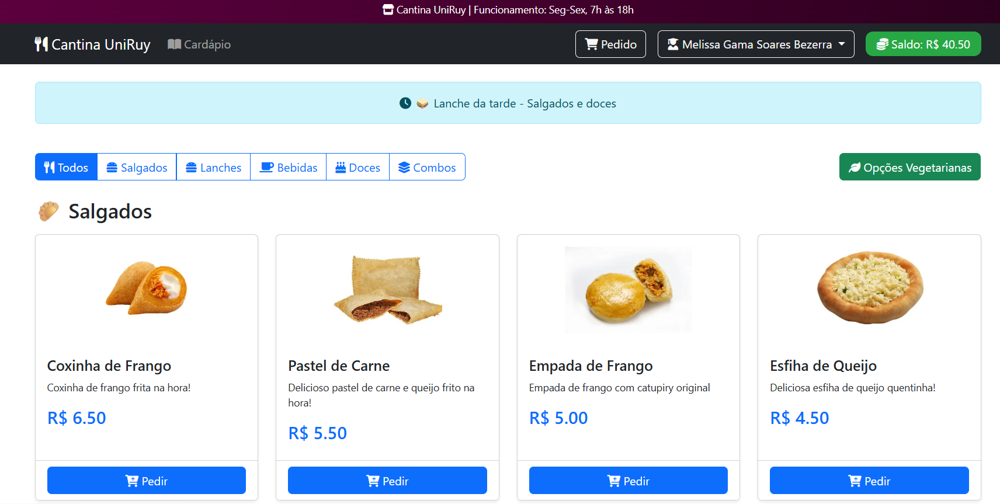
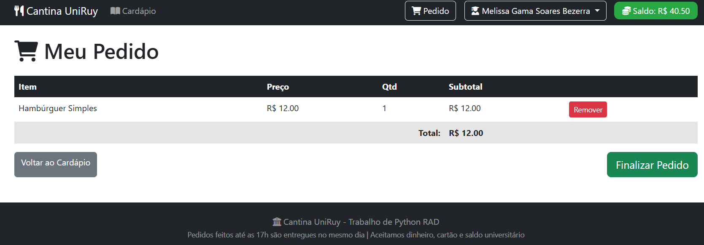
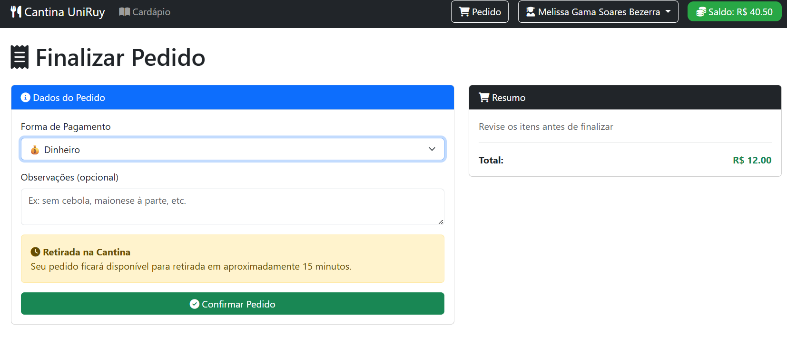
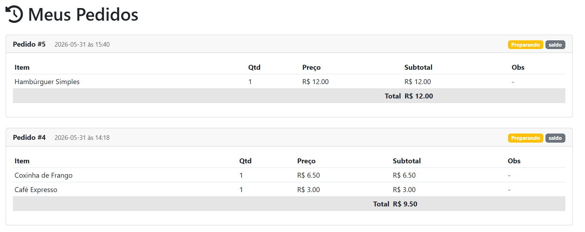
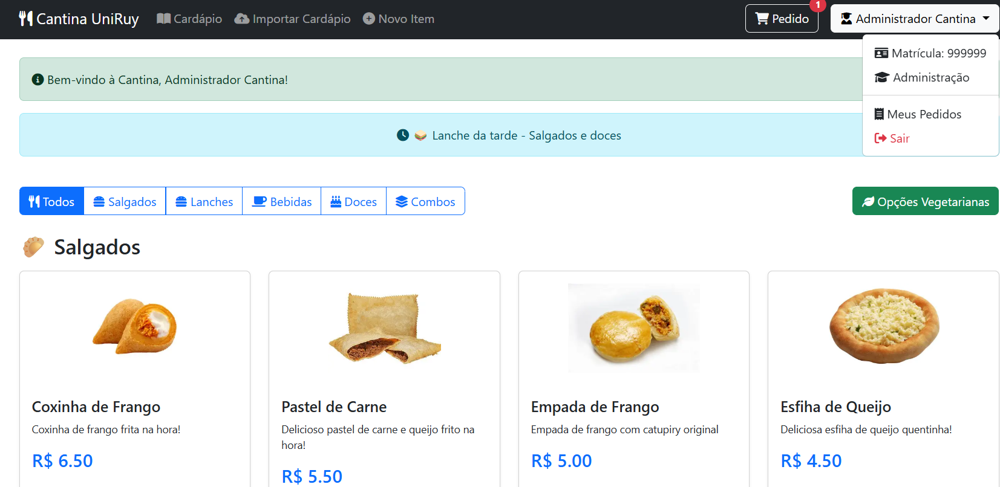

#  Cantina Universitária - Uniruy

Sistema de pedidos online para cantina universitária desenvolvido em Flask.

##  Sobre o Projeto

Projeto de um sistema e-commerce de uma cantina universitária referente à matéria de **Desenvolvimento Rápido de Aplicações em Python**, como requisito parcial para aprovação na disciplina. As funcionalidades incluem permitir que alunos da faculdade façam pedidos na cantina da universidade de forma online, consultem o cardápio e visualizem seu histórico de pedidos.

##  Acesso Online

O sistema está hospedado na nuvem, através da plataforma PythonAnywhere, e pode ser acessado de qualquer lugar:

** Link do site:** [https://melissagsb.pythonanywhere.com](https://melissagsb.pythonanywhere.com)

##  Funcionalidades

### Para Alunos
-  **Login e Cadastro** - Alunos podem criar conta com matrícula e curso
-  **Cardápio Digital** - Visualização de todos os itens disponíveis
-  **Filtros** - Filtrar produtos por categoria
-  **Filtro Vegetariano** - Opção para exibir apenas produtos vegetarianos
-  **Carrinho de Compras** - Adicionar e remover itens do pedido
-  **Finalização de Pedido** - Múltiplas formas de pagamento (dinheiro, cartão, saldo acadêmico)
-  **Histórico de Pedidos** - Consultar todos os pedidos realizados na conta
-  **Saldo do Aluno** - Bônus inicial de R$ 50,00 para novos cadastros

### Para Administrador
-  **Gerenciar Cardápio** - Adicionar, editar e remover produtos
-  **Importar Produtos** - Importar itens via API externa
- **Controle de Estoque** - Gerenciar quantidade disponível de cada produto

## Tecnologias Utilizadas

| Tecnologia | Finalidade |
|------------|------------|
| **Python 3.10+** | Linguagem de programação |
| **Flask** | Framework web |
| **SQLite** | Banco de dados relacional |
| **SQLAlchemy** | ORM para banco de dados |
| **Flask-Login** | Gerenciamento de sessão e autenticação |
| **Werkzeug** | Hash de senhas e segurança |
| **Bootstrap 5** | Frontend e responsividade |
| **Jinja2** | Templates HTML |
| **Requests** | Consumo de API externa |

## Como Executar Localmente

### Pré-requisitos
- Python 3.10 ou superior
- Git
- Pip

### Passo a passo

```bash
# Clone o repositório
git clone https://github.com/melissagsb/cantina-universitaria.git
cd cantina-universitaria

# Crie um ambiente virtual
python -m venv venv

# Ative o ambiente virtual (Windows)
venv\Scripts\activate

# Ative o ambiente virtual (Mac/Linux)
source venv/bin/activate

# Instale as dependências
pip install -r requirements.txt

# Execute a aplicação
python app.py
```

Acesse no navegador: `http://localhost:5000`

##  Credenciais de Acesso

| Tipo | Email | Senha | Saldo |
|------|-------|-------|-------|
| Administrador | admin@cantina.com | admin123 | R$ 0,00 |
| Aluno Teste | aluno@faculdade.com | 123456 | R$ 50,00 |

>  **Dica:** Crie seu próprio cadastro de aluno para ganhar o bônus de R$ 50,00!

##  Estrutura do Projeto

```
cantina-universitaria/
├── 📁 screenshots/
│   ├── home_cantina.png
│   ├── carrinho.png
│   ├── checkout.png
│   ├── pedidos.png
│   └── home_administrador.png
├── 📁 templates/
│   ├── base_cantina.html
│   ├── cardapio.html
│   ├── carrinho.html
│   ├── checkout_cantina.html
│   ├── pedidos_cantina.html
│   ├── login_cantina.html
│   ├── cadastro_cantina.html
│   ├── produto_criar_cantina.html
│   └── produto_editar_cantina.html
├── 📄 app.py
├── 📄 models.py
├── 📄 api_client.py
├── 📄 requirements.txt
├── 📄 .gitignore
└── 📄 README.md
```

##  Screenshots

### Página Inicial - Home


### Carrinho de Compras


### Finalizar Pedido


### Histórico de Pedidos


### Área Administrativa


##  API Utilizada

O sistema consome a **Fake Store API** ([fakestoreapi.com](https://fakestoreapi.com/)) para importar imagens e dados de produtos, adaptando-os para o contexto da cantina universitária. Entretanto, também foram utilizadas imagens escolhidas manualmente para que coincidissem com os produtos vendidos.

##  Requisitos do Trabalho Atendidos

| Requisito | Status | Implementação |
|-----------|--------|----------------|
| App Web Python | ✅ | Flask + Jinja2 |
| Frontend + Backend | ✅ | HTML/Bootstrap + Python |
| Banco de Dados | ✅ | SQLite (Relacional) |
| Domínio (Área da faculdade) | ✅ | Cantina Universitária |
| Login | ✅ | Flask-Login com hash de senha |
| 4+ Requisitos Funcionais | ✅ | 6 funcionalidades implementadas |
| CRUD completo | ✅ | Produtos (Criar, Ler, Editar, Deletar) |
| Relatório | ✅ | Histórico de pedidos |
| API Externa | ✅ | Fake Store API |

##  Autora

**Melissa Gama Soares Bezerra** - Bacharelanda em Ciência da Computação

##  Informações Acadêmicas

| Campo | Informação |
|-------|-------------|
| Disciplina | Desenvolvimento Rápido de Aplicações em Python (Python RAD) |
| Universidade | Uniruy Wyden - Campus Salvador |
| Orientador | Heleno Cardoso |
| Período | 2026.1 |

##  Licença

Este projeto foi desenvolvido para fins acadêmicos.

---

